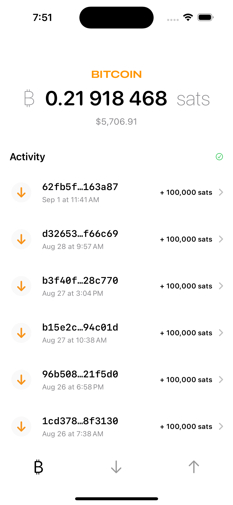

# CypherPunk Culture Wallet
CypherPunk Culture, a term coined in the late 1980s, refers to a community of activists and technologists promoting the use of strong cryptographic tools to enhance privacy and security. This movement has been influential in shaping the modern discourse around digital privacy, encryption, and online anonymity.

An example iOS app using [Bitcoin Dev Kit](https://github.com/bitcoindevkit) (BDK)

## Functionality

*This is an experimental work in progress.*

### Wallet

Supports single key HD wallets with BIP86 derivation paths. 

### Implemented

- [x] Create Wallet `Wallet(descriptor: changeDescriptor: network: databaseConfig:)`

- [x] Get Address `getAddress`

- [x] Get Balance `getBalance`

- [x] List Transactions `listTransactions`

- [x] Send `send`

- [x] Sync `sync`

## Swift Packages

- [bdk-swift](https://github.com/bitcoindevkit/bdk-swift)

- [BitcoinUI](https://github.com/reez/BitcoinUI)

- [KeychainAccess](https://github.com/kishikawakatsumi/KeychainAccess)
